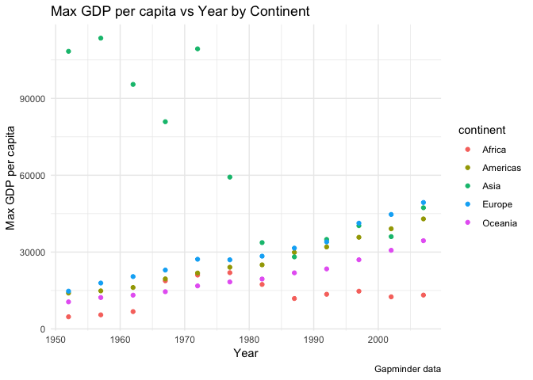
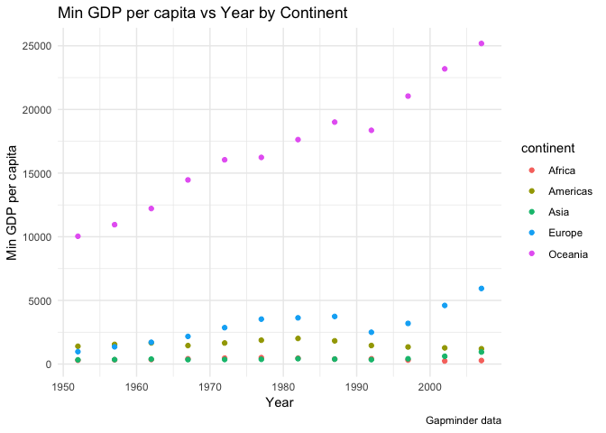
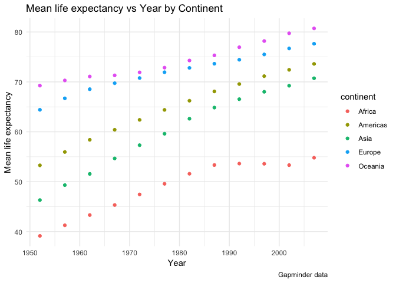
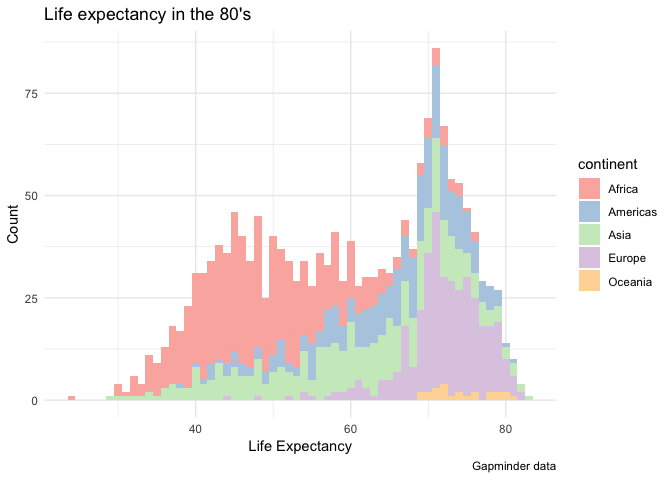
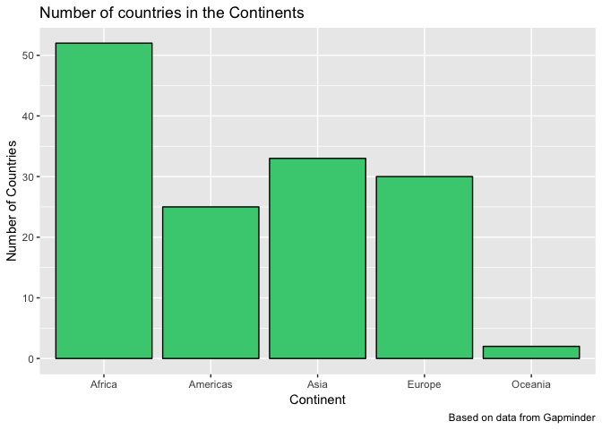

hw02 - Explore Gapminder and use dplyr
================
Adam Mattsson
2018-09-25

hw02 - Explore Gapminder and use dplyr
======================================

The goal is to explore a dataset. In particular, to begin to establish a workflow for data frames or “tibbles”. You will use dplyr and ggplot2 to do some description and visualization.

Bring rectangular data in
-------------------------

For this assignment I decided to stick with the gapminder data set. To refresh your memory, the gapminder dataset is a massive UN database that compares the populations, gdp per capita, and life expectancy for most countries in 5-year increments between 1952 and 2007. First, let's bring in rectangular data and load, for this assignment, required packages.

Load data required packages:

``` r
#load dplyr via tidyverse metapackage
suppressWarnings(suppressMessages(library(tidyverse)))
#load knitr
suppressWarnings(suppressMessages(library(knitr)))
#load ggplot2
suppressWarnings(suppressMessages(library(ggplot2)))
#load gapminder dataset
suppressWarnings(suppressMessages(library(gapminder)))
```

Smell test the data
-------------------

#### 1. Is it a data.frame, a matrix, a vector, a list?

For this first part of the assignment, it's time to familiarize our selves with the structure of the data that we're working with. By calling the `str()` function we'll get some nice metrics on our data.

``` r
str(gapminder)
```

    ## Classes 'tbl_df', 'tbl' and 'data.frame':    1704 obs. of  6 variables:
    ##  $ country  : Factor w/ 142 levels "Afghanistan",..: 1 1 1 1 1 1 1 1 1 1 ...
    ##  $ continent: Factor w/ 5 levels "Africa","Americas",..: 3 3 3 3 3 3 3 3 3 3 ...
    ##  $ year     : int  1952 1957 1962 1967 1972 1977 1982 1987 1992 1997 ...
    ##  $ lifeExp  : num  28.8 30.3 32 34 36.1 ...
    ##  $ pop      : int  8425333 9240934 10267083 11537966 13079460 14880372 12881816 13867957 16317921 22227415 ...
    ##  $ gdpPercap: num  779 821 853 836 740 ...

This returns some valuable information on our data structure. We can see that our data is a **data frame** (also defined as tibble, since we've loaded tidyverse). We can also get type of data by calling the `typeof()` function.

``` r
typeof(gapminder)
```

    ## [1] "list"

Tibbles is a type of **list**.

#### 2. What is its class?

To return the class of the data, let's call the `class()` fucntion on our dataset.

``` r
class(gapminder)
```

    ## [1] "tbl_df"     "tbl"        "data.frame"

The Gapminder dataset is a **table**, **tibble** and **data frame**.

#### 3. How many variables/columns?

To inspect the number of columns present in our dataset, we can call the function `ncol()`.

``` r
ncol(gapminder)
```

    ## [1] 6

In the gapminder dataset, there are **6** columns/variables present.

#### 4. How many rows/observations?

Let's call `nrow()` to return the number of rows in our dataset.

``` r
nrow(gapminder)
```

    ## [1] 1704

The gapminder dataset consits of **1704** rows/observations

#### 5. Can you get these facts about “extent” or “size” in more than one way? Can you imagine different functions being useful in different contexts?

If we're interested in the dimensions of our dataset we could call the `dim()` function. This returns both the number of rows and number columns with just on argument!.

``` r
dim(gapminder)
```

    ## [1] 1704    6

The output matches the individual outputs we got from `ncol()` and `nrow()`, nice.

We can also use `lenght()` on the gapminder dataset to return the number of elements in a list. Since each column is a list, this chunk of code should return the number of columns.

``` r
length(gapminder)
```

    ## [1] 6

``` r
#check if TRUE
length(gapminder) == ncol(gapminder)
```

    ## [1] TRUE

Yes, `length(gapminder)` matches `ncol(gapminder)`.

Of course, it's also possible to print the whole data set, but for large-scale data sets this information might be somewhat overwhelming and difficult to grasp (it will just fill your console with data and nobody wants that!). Instead, it could be a great idea to only print the beginning (and end) of the data, as such;

``` r
#print first six entries of the data
head(gapminder)
```

    ## # A tibble: 6 x 6
    ##   country     continent  year lifeExp      pop gdpPercap
    ##   <fct>       <fct>     <int>   <dbl>    <int>     <dbl>
    ## 1 Afghanistan Asia       1952    28.8  8425333      779.
    ## 2 Afghanistan Asia       1957    30.3  9240934      821.
    ## 3 Afghanistan Asia       1962    32.0 10267083      853.
    ## 4 Afghanistan Asia       1967    34.0 11537966      836.
    ## 5 Afghanistan Asia       1972    36.1 13079460      740.
    ## 6 Afghanistan Asia       1977    38.4 14880372      786.

``` r
#print last six entries of the data
tail(gapminder)
```

    ## # A tibble: 6 x 6
    ##   country  continent  year lifeExp      pop gdpPercap
    ##   <fct>    <fct>     <int>   <dbl>    <int>     <dbl>
    ## 1 Zimbabwe Africa     1982    60.4  7636524      789.
    ## 2 Zimbabwe Africa     1987    62.4  9216418      706.
    ## 3 Zimbabwe Africa     1992    60.4 10704340      693.
    ## 4 Zimbabwe Africa     1997    46.8 11404948      792.
    ## 5 Zimbabwe Africa     2002    40.0 11926563      672.
    ## 6 Zimbabwe Africa     2007    43.5 12311143      470.

In my opinion, one of the better ways of initially viewing the dataset is to print a summary that tells us information such as the distribution of our observations and variables. This is performed by calling the `summary()` function on the data set, as such:

``` r
summary(gapminder)
```

    ##         country        continent        year         lifeExp     
    ##  Afghanistan:  12   Africa  :624   Min.   :1952   Min.   :23.60  
    ##  Albania    :  12   Americas:300   1st Qu.:1966   1st Qu.:48.20  
    ##  Algeria    :  12   Asia    :396   Median :1980   Median :60.71  
    ##  Angola     :  12   Europe  :360   Mean   :1980   Mean   :59.47  
    ##  Argentina  :  12   Oceania : 24   3rd Qu.:1993   3rd Qu.:70.85  
    ##  Australia  :  12                  Max.   :2007   Max.   :82.60  
    ##  (Other)    :1632                                                
    ##       pop              gdpPercap       
    ##  Min.   :6.001e+04   Min.   :   241.2  
    ##  1st Qu.:2.794e+06   1st Qu.:  1202.1  
    ##  Median :7.024e+06   Median :  3531.8  
    ##  Mean   :2.960e+07   Mean   :  7215.3  
    ##  3rd Qu.:1.959e+07   3rd Qu.:  9325.5  
    ##  Max.   :1.319e+09   Max.   :113523.1  
    ## 

This summary provides us with valuable information on how to look at our data. Such as the data-size, distribution of our observations and variable distribution.

#### 6. What data type is each variable?

In order to inspect each variable in a data set one could apply the `sapply()` function. This returns the data type of each of the variables (columns).

``` r
sapply(gapminder, class)
```

    ##   country continent      year   lifeExp       pop gdpPercap 
    ##  "factor"  "factor" "integer" "numeric" "integer" "numeric"

Explore individual variables
----------------------------

#### 1. What are possible values (or range, whichever is appropriate) of each variable?

To assess the possible values or ranges we can call the `range()` function. This will return the range of the values for that variable. For example, let's find out the earliest and latest year in the Gapminder dataset.

``` r
range(gapminder$year)
```

    ## [1] 1952 2007

The earliest year in the Gapminder dataset is **1952** and the latest year is **2007**.

Let's use this approach to get other information, such as the range of life expectancy.

``` r
range(gapminder$lifeExp)
```

    ## [1] 23.599 82.603

In the Gapminder dataset the lowest lifeexpectancy is **23.599** years and the longest life expectancy is **82.603**.

We can use a different function to get the number of countries that are present in the country variable. This information could be retrieved by using the following statement.

``` r
unique(gapminder$country) %>%
  length()
```

    ## [1] 142

Ok, so there's **142** countries present in the country variable. There are many different ways to retrieve the same information in R. Another way to find out the number of countries in the country variable is to use the `nlevels()` function. Let's try it.

``` r
nlevels(gapminder$country)
```

    ## [1] 142

Nice, this argument returns the same value as before.

Before moving on to the next part, let's find out the values for the continent variable and present them in a nice table, using the `knitr` package.

``` r
unique(select(gapminder, continent)) %>%
  kable(align = "l", caption = "Continents in Gapminder dataset", format = "markdown", padding = 2)
```

| continent |
|:----------|
| Asia      |
| Europe    |
| Africa    |
| Americas  |
| Oceania   |

#### 2. What values are typical? What’s the spread? What’s the distribution? Etc., tailored to the variable at hand.

The easiest way to get the distribution, spread, typical values etc. is to call the `summary()` function directly on the variable of interest. Let's try it out on life expectancy and GDP per capita and continent.

``` r
#lifeExp
summary(gapminder$lifeExp)
```

    ##    Min. 1st Qu.  Median    Mean 3rd Qu.    Max. 
    ##   23.60   48.20   60.71   59.47   70.85   82.60

``` r
#gdpPercap
summary(gapminder$gdpPercap)
```

    ##     Min.  1st Qu.   Median     Mean  3rd Qu.     Max. 
    ##    241.2   1202.1   3531.8   7215.3   9325.5 113523.1

``` r
#continent
summary(gapminder$continent)
```

    ##   Africa Americas     Asia   Europe  Oceania 
    ##      624      300      396      360       24

The output gives us exactly what we're looking for. We can easily investigate metrics such as the smallest value, 1st quantile, median, mean 3rd quantile, and largest value by calling the `summary()` on any numeric or integer variables. For continents, the argument returns the number of observations from each factor, very useful!

#### 3. Feel free to use summary stats, tables, figures. We’re NOT expecting high production value (yet).

Before diving deeper into generating plots, let's first try to plot the max gdp per capita vs year for each continent.

``` r
#group by continent and year
group_by(gapminder, continent, year) %>%
  #create new object with max gdp
  summarize(Maxgdp = max(gdpPercap)) %>%
  #plotting max gdp Per cpaita vs year
  ggplot(aes(x = year, y = Maxgdp)) + 
  #add colours for continents
  geom_point(aes(colour = continent)) +
  #adding theme to plot
  theme_minimal() +
  #formatting labels, axis etc.
  labs(title = "Max GDP per capita vs Year by Continent", x = "Year", y = "Max GDP per capita", caption = "Gapminder data")
```



Just for comparrision, let's plot the min GDP per capita vs year for each continent.

``` r
#group by continent and year
group_by(gapminder, continent, year) %>%
  #create new object with min gdp
  summarize(Mingdp = min(gdpPercap)) %>%
  #plotting main gdp Per cpaita vs year
  ggplot(aes(x = year, y = Mingdp)) + 
  #add colours for continents
  geom_point(aes(colour = continent)) +
  #adding theme to plot
  theme_minimal() +
  #formatting labels, axis etc.
  labs(title = "Min GDP per capita vs Year by Continent", x = "Year", y = "Min GDP per capita", caption = "Gapminder data")
```



The plots are visualizing some interesting information. From this data, it looks like max GDP per capita in Asia was considerably higher between 1952 and 1980 and Oceania have a considerably higher min GDP per capita compared to the rest of the continents in the Gapminder dataset.

Explore various plot types
--------------------------

#### 1. A scatterplot of two quantitative variables.

For this part, let's try to plot the mean life expectancy vs year for each continent.

``` r
#group by continent and year
group_by(gapminder, continent, year) %>%
  #create new object with mean life expectancy
  summarize(meanLifeExp = mean(lifeExp)) %>%
  #plotting mean life expectancy vs year
  ggplot(aes(x = year, y = meanLifeExp)) + 
  #add colours for continents
  geom_point(aes(colour = continent)) +
  #adding theme to plot
  theme_minimal() +
  #formatting labels, axis etc.
  labs(title = "Mean life expectancy vs Year by Continent", x = "Year", y = "Mean life expectancy", caption = "Gapminder data")
```



This is pretty interesting, there seems to be a trend in increasing mean Life Expectancy as the years go on, which seems about right.

#### 2. A plot of one quantitative variable. Maybe a histogram or density plot or frequency polygon.

Let's create a new plot visualizing the lifeexpectancy distribution in the 80's. Also, let's add colour overlay by continent.

``` r
#filter years to maintain 1980-1990
filter(gapminder, year > 1979 | year < 1990) %>%
  #plot lifeExp by continent
  ggplot(aes(x = lifeExp, fill = continent)) +
  #specify bin width of histogram
  geom_histogram(binwidth = 1) +
  #add theme
  theme_minimal() +
  #specify colour palette
  scale_fill_brewer(palette="Pastel1") +
  #add albels etc.
  labs(title = "Life expectancy in the 80's", 
       x = "Life Expectancy", y = "Count",caption = "Gapminder data")
```



From looking at the plot we can see that Africa has a substantially lower life expectancy then the rest of the continents. This figure also highlights the fact that the number of entries in the Oceania continent are substantially lower compared to other continents. This could be something to keep in mind when evaluating the data.

#### 3. A plot of one quantitative variable and one categorical. Maybe boxplots for several continents or countries.

For this part I've decided to plot the number of countries present in each continent, to further highlight the fact that the Oceania data is very sparse compared to other continents.

``` r
#groupt gapminder by continent
group_by(gapminder,continent) %>%
  #get the number of countries in each continent
  summarize(nCountries = length(unique(country))) -> data

#plot data
ggplot(data, aes(x = continent, weight = nCountries)) + 
  #specifu colours and outline
  geom_bar(fill = "seagreen3", colour = "black") +
  #adding labels etc.
  labs(title = "Number of countries in the Continents", x = "Continent", y = "Number of Countries",caption = "Based on data from Gapminder")
```



Perfect, this plot really does visualize what we expected from the previous plot. Oceania is definitely under represented in the gapminder dataset.

But I want to do more!
----------------------

Evaluate this code and describe the result. Presumably, the analyst’s intent was to get the data for Rwanda and Afghanistan. Did they succeed? Why or why not? If not, what is the correct way to do this?

`filter(gapminder, country == c("Rwanda", "Afghanistan"))`

This argument goes through the lists in parallel which means that only half of the Rwanda and Afghanistan was outputted. One possible solution to the anlysit's problem could be to specify the argument as such:

``` r
filter(gapminder, country %in% c("Rwanda" , "Afghanistan")) %>%
  kable(align = rep("l", 5), padding = 5)
```

| country     | continent | year | lifeExp | pop      | gdpPercap |
|:------------|:----------|:-----|:--------|:---------|:----------|
| Afghanistan | Asia      | 1952 | 28.801  | 8425333  | 779.4453  |
| Afghanistan | Asia      | 1957 | 30.332  | 9240934  | 820.8530  |
| Afghanistan | Asia      | 1962 | 31.997  | 10267083 | 853.1007  |
| Afghanistan | Asia      | 1967 | 34.020  | 11537966 | 836.1971  |
| Afghanistan | Asia      | 1972 | 36.088  | 13079460 | 739.9811  |
| Afghanistan | Asia      | 1977 | 38.438  | 14880372 | 786.1134  |
| Afghanistan | Asia      | 1982 | 39.854  | 12881816 | 978.0114  |
| Afghanistan | Asia      | 1987 | 40.822  | 13867957 | 852.3959  |
| Afghanistan | Asia      | 1992 | 41.674  | 16317921 | 649.3414  |
| Afghanistan | Asia      | 1997 | 41.763  | 22227415 | 635.3414  |
| Afghanistan | Asia      | 2002 | 42.129  | 25268405 | 726.7341  |
| Afghanistan | Asia      | 2007 | 43.828  | 31889923 | 974.5803  |
| Rwanda      | Africa    | 1952 | 40.000  | 2534927  | 493.3239  |
| Rwanda      | Africa    | 1957 | 41.500  | 2822082  | 540.2894  |
| Rwanda      | Africa    | 1962 | 43.000  | 3051242  | 597.4731  |
| Rwanda      | Africa    | 1967 | 44.100  | 3451079  | 510.9637  |
| Rwanda      | Africa    | 1972 | 44.600  | 3992121  | 590.5807  |
| Rwanda      | Africa    | 1977 | 45.000  | 4657072  | 670.0806  |
| Rwanda      | Africa    | 1982 | 46.218  | 5507565  | 881.5706  |
| Rwanda      | Africa    | 1987 | 44.020  | 6349365  | 847.9912  |
| Rwanda      | Africa    | 1992 | 23.599  | 7290203  | 737.0686  |
| Rwanda      | Africa    | 1997 | 36.087  | 7212583  | 589.9445  |
| Rwanda      | Africa    | 2002 | 43.413  | 7852401  | 785.6538  |
| Rwanda      | Africa    | 2007 | 46.242  | 8860588  | 863.0885  |
